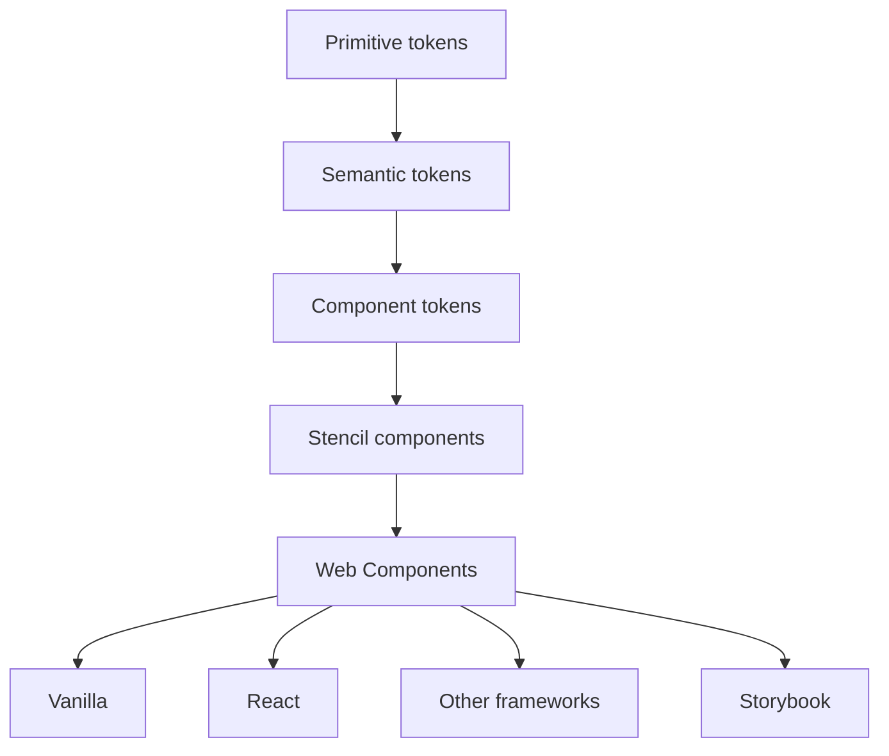

# Web Component Design System Starter

A production-oriented starter architecture for building framework-agnostic design systems with Stencil, TypeScript, Web Components, Storybook, design tokens, accessibility testing, and disciplined releases.

This is a reference implementation—not an established product design system. Replace the generic `ds-` prefix before adopting it in an organization.

## Architecture



The same native custom elements power every consumer and Storybook; there is no parallel framework implementation. Shadow DOM protects internals while inherited CSS custom properties, attributes, slots, events, and a small `::part` surface form the customization contract.

## Setup and development

Requires Node 22.12 or newer.

```sh
npm ci
npm run dev
npm run storybook
```

Quality commands: `npm run lint`, `npm run format:check`, `npm run typecheck`, `npm test`, `npm run test:browser`, `npm run test:storybook`, `npm run build:storybook`, `npm run build:examples`, `npm run verify:package`, and `npm run verify:consumers`.

Create a component with `npm run generate ds-example`, then follow [component guidelines](docs/component-guidelines.md). Public CSS is in `src/styles`; import `@hanifb/web-component-design-system-starter/styles` and register lazy components from the package loader.

```js
import '@hanifb/web-component-design-system-starter/styles';
import { defineCustomElements } from '@hanifb/web-component-design-system-starter/loader';
defineCustomElements();
```

```html
<ds-button><ds-icon name="check" slot="start"></ds-icon>Save</ds-button>
<ds-input label="Email" name="email" type="email"></ds-input>
```

React 19 renders custom elements directly. The example augments React's JSX types so `ondsInput` receives the typed `CustomEvent<string>` without a wrapper component. See `examples/react`.

## Tokens, themes, and customization

Tokens flow primitive → semantic → component. Set `data-theme="dark"` on an ancestor or override semantic tokens for a custom theme. Component internals should not be queried. Prefer tokens, documented properties, slots, events, then exposed parts. See [design tokens](docs/design-tokens.md) and [architecture](docs/architecture.md).

## Testing and accessibility

Stencil's first-class Vitest package covers component and Chromium browser tests. Storybook's official a11y addon runs axe checks. Native controls provide baseline semantics; focus, disabled/loading behavior, labels, descriptions, and errors are part of the implementation. Automated checks do not certify WCAG conformance—manual keyboard, screen-reader, zoom, contrast, and forced-colors review remains required. See [accessibility](docs/accessibility.md).

## Build, package, and releases

`npm run build` produces lazy `dist`, loader, and individually importable `dist-custom-elements` outputs. `npm run verify:package` checks the packed contents and public import paths. `npm run verify:consumers` installs that packed artifact—not the source checkout—into isolated vanilla JavaScript and React fixtures, then bundles both. This protects the package exports, runtime registration, styles, React JSX augmentation, and typed custom-event contract without publishing.

Changesets classify fixes as patch, additive APIs as minor, and breaking public changes as major. The release workflow prepares a reviewed version PR and GitHub release; npm publishing remains intentionally disabled until maintainers explicitly configure it.

See [contributing](docs/contributing.md). Current browser support targets evergreen browsers with Custom Elements, Shadow DOM, CSS custom properties, and ElementInternals. Form-associated custom-element support is required for native `ds-input` form participation; consumers needing legacy browsers must provide a deliberate fallback.

## License

MIT
