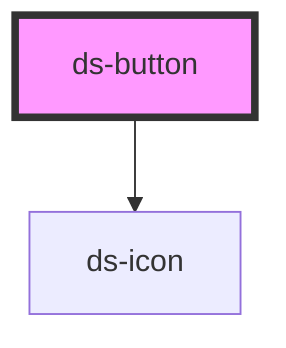

# ds-button

<!-- Auto Generated Below -->

## Overview

A theme-aware action control that preserves native button semantics.

## Usage

### Basic

Use the default slot for the label and named slots for optional icons:

```html
<ds-button type="submit">
  <ds-icon name="check" slot="start"></ds-icon>
  Save
</ds-button>
```

`type="submit"` and `type="reset"` act on the nearest light-DOM form. The default `button` type has no implicit form action.

## Properties

| Property   | Attribute  | Description                                         | Type                                                 | Default     |
| ---------- | ---------- | --------------------------------------------------- | ---------------------------------------------------- | ----------- |
| `disabled` | `disabled` | Prevent interaction.                                | `boolean`                                            | `false`     |
| `loading`  | `loading`  | Indicate progress and prevent duplicate activation. | `boolean`                                            | `false`     |
| `size`     | `size`     | Control size.                                       | `"lg" \| "md" \| "sm"`                               | `'md'`      |
| `type`     | `type`     | Native button type.                                 | `"button" \| "reset" \| "submit"`                    | `'button'`  |
| `variant`  | `variant`  | Visual style.                                       | `"danger" \| "primary" \| "secondary" \| "tertiary"` | `'primary'` |

## Slots

| Slot      | Description    |
| --------- | -------------- |
|           | Label.         |
| `"end"`   | Trailing icon. |
| `"start"` | Leading icon.  |

## Shadow Parts

| Part           | Description              |
| -------------- | ------------------------ |
| `"button"`     | Native button control.   |
| `"end-icon"`   | Trailing icon container. |
| `"start-icon"` | Leading icon container.  |

## Dependencies

### Depends on

- [ds-icon](../ds-icon)

### Graph



---

_Generated from source. Do not edit below the marker._
