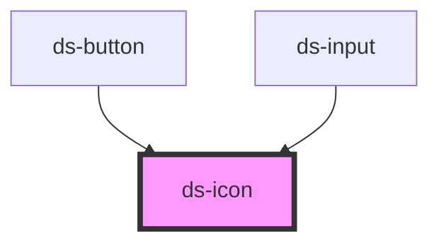

# ds-icon

<!-- Auto Generated Below -->

## Overview

A small bundled icon primitive for decorative and meaningful icons.

## Usage

### Basic

Icons inside labeled controls are decorative by default. Give only meaningful standalone icons a label:

```html
<ds-icon name="info" label="More information"></ds-icon>
```

## Properties

| Property | Attribute | Description                                                                  | Type                                                    | Default     |
| -------- | --------- | ---------------------------------------------------------------------------- | ------------------------------------------------------- | ----------- |
| `label`  | `label`   | Accessible name for a meaningful standalone icon. Omit for decorative icons. | `string \| undefined`                                   | `undefined` |
| `name`   | `name`    | Icon from the starter's intentionally small, bundled set.                    | `"check" \| "close" \| "info" \| "search" \| "spinner"` | `'info'`    |
| `size`   | `size`    | Rendered icon size.                                                          | `"lg" \| "md" \| "sm"`                                  | `'md'`      |

## Shadow Parts

| Part    | Description                              |
| ------- | ---------------------------------------- |
| `"svg"` | SVG element containing the icon artwork. |

## Dependencies

### Used by

- [ds-button](../ds-button)
- [ds-input](../ds-input)

### Graph



---

_Generated from source. Do not edit below the marker._
