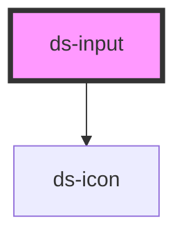

# ds-input

<!-- Auto Generated Below -->

## Overview

A labeled, form-associated text field with description and validation support.

## Usage

### Basic

Provide a visible label and a name when the field participates in a form:

```html
<ds-input
  description="Used for account notifications."
  label="Email"
  name="email"
  required
  type="email"
></ds-input>
```

Listen for `dsInput`; its `detail` is the current string value. The component participates in `FormData`, constraint validation, reset, and disabled fieldsets through `ElementInternals`.

## Properties

| Property             | Attribute       | Description                                  | Type                                                            | Default     |
| -------------------- | --------------- | -------------------------------------------- | --------------------------------------------------------------- | ----------- |
| `autocomplete`       | `autocomplete`  | Native autocomplete token.                   | `string \| undefined`                                           | `undefined` |
| `description`        | `description`   | Supporting description.                      | `string \| undefined`                                           | `undefined` |
| `disabled`           | `disabled`      | Disable interaction and form submission.     | `boolean`                                                       | `false`     |
| `errorMessage`       | `error-message` | Error text shown while invalid.              | `string \| undefined`                                           | `undefined` |
| `invalid`            | `invalid`       | Communicate an invalid value.                | `boolean`                                                       | `false`     |
| `label` _(required)_ | `label`         | Visible accessible label.                    | `string`                                                        | `undefined` |
| `name`               | `name`          | Form field name.                             | `string \| undefined`                                           | `undefined` |
| `placeholder`        | `placeholder`   | Native placeholder.                          | `string \| undefined`                                           | `undefined` |
| `readonly`           | `readonly`      | Prevent edits without disabling the control. | `boolean`                                                       | `false`     |
| `required`           | `required`      | Require a value.                             | `boolean`                                                       | `false`     |
| `type`               | `type`          | Native input type.                           | `"email" \| "password" \| "search" \| "tel" \| "text" \| "url"` | `'text'`    |
| `value`              | `value`         | Current value.                               | `string`                                                        | `''`        |

## Events

| Event     | Description                                                        | Type                  |
| --------- | ------------------------------------------------------------------ | --------------------- |
| `dsInput` | Fires as the user edits. Detail contains the current string value. | `CustomEvent<string>` |

## Shadow Parts

| Part      | Description           |
| --------- | --------------------- |
| `"input"` | Native input control. |

## Dependencies

### Depends on

- [ds-icon](../ds-icon)

### Graph



---

_Generated from source. Do not edit below the marker._
